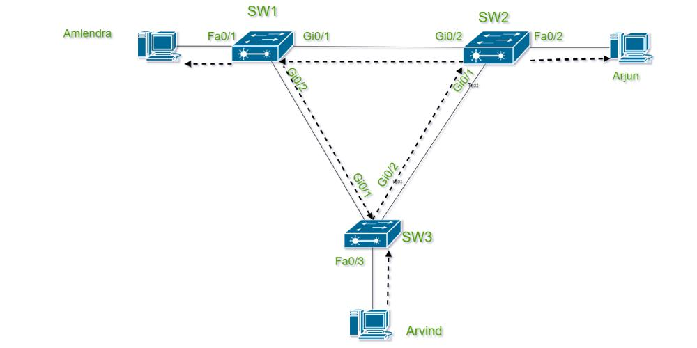
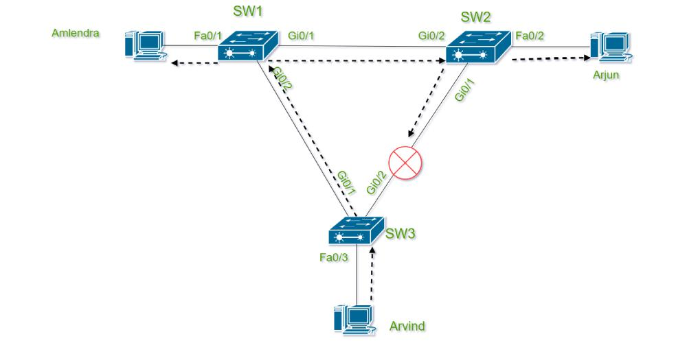
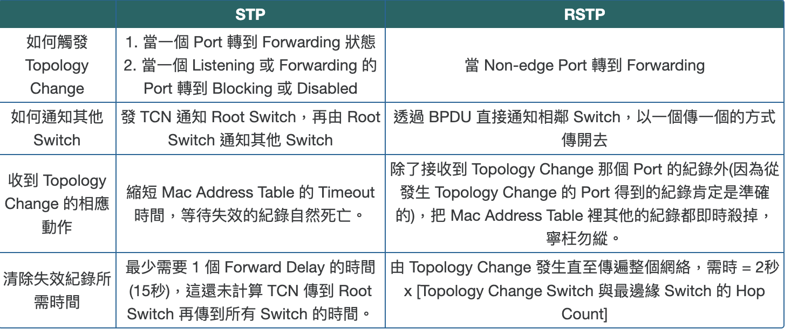

# Rapid Spanning Tree Protocol
## 鄭仴筑 Yue-Chu Cheng

---

# What is the network topology?
- Network topology defines how the components in the network environment interact with each other, in order to design efficient and robust networks.
- Network topology consists of different elements like nodes, links, and devices in a computer network.

---

# Connection between switches
- Switch 之間有可能同時會有多個port相連，為了提高網路的reliability, performance, scalability
  - reliability
    - 當交換機之間有多個連接時，如果其中一條連接失效，數據仍然可以通過其他連接傳輸，這樣可以避免single point of failure
  - performance
    - 多個port相連可以提高bandwidth
    - load balance:將流量分配到不同的鏈路上，避免單一鏈路過載
    - 獨立的數據流量: 在一些網路配置中，不同類型的數據流量（如語音和視頻）可能會被分配到不同的鏈路上，以減少延遲和提高質量
  - scalability
    - 方便地增加或重新配置連接，滿足增長的網路需求​ 

---

# What is MAC address table
- The switch maintains an address table called the MAC address table in order to efficiently switch frames between interfaces. So basically a switch stores information about the other (Ethernet interfaces) to which it is connected on a network. when a switch receives a frame, it associates the MAC address of the sending device with the switch port on which it was received.
- Type of MAC address table entries
  - Static Entries: Static entries have high priority than dynamic entries and remain active they can be changed or removed by the switch administrator as they are manually added by the switch administrator.
  - Dynamic Entries: Dynamic entries are added to the table automatically with a process called MAC learning here the switch fetches the source MAC address of each Ethernet frame received on the port. Dynamic entries are automated they are automatically deleted

- MAC address table更新的原因
  - 新設備加入網路: 當新的設備連接到交換機時，交換機會接收到該設備發送的數據幀。交換機根據這些數據幀更新 MAC 地址表，將新設備的 MAC 地址與相應的端口綁定。
  - 設備移動: 當設備從一個端口移動到另一個端口時，交換機會接收到來自該設備的新數據幀，並更新 MAC 地址表以反映新的端口位置。
  - data frame的學習過程: 交換機通過接收和處理數據幀，不斷學習網路中設備的 MAC 地址，並將這些地址與相應的端口記錄在 MAC 地址表中。
    - Example
      - 假設有一個交換機（Switch），兩個終端設備（E1 和 E2）連接到這個交換機。設備 E1 連接到交換機的端口 Fa0/1，設備 E2 連接到端口 Fa0/2。
      - 初始數據幀發送：
        - 設備 E1 發送一個數據幀到設備 E2。數據幀包含源 MAC 地址 MAC_E1 和目標 MAC 地址 MAC_E2。
        - 交換機接收到這個數據幀，並檢查其 MAC 地址表。
      - 源 MAC 地址學習：
        - 交換機發現 MAC 地址表中沒有 MAC_E1，所以會將 MAC_E1 與端口 Fa0/1 綁定，更新其 MAC 地址表：
        MAC 地址      | 端口
        ------------------------
        MAC_E1        | Fa0/1
        - 目標 MAC 地址查找和廣播：交換機檢查目標 MAC 地址 MAC_E2，發現 MAC 地址表中沒有 MAC_E2，於是將數據幀廣播到所有端口，除了接收端口 Fa0/1。
        - 回應過程：
          - 設備 E2 接收到數據幀，發送回應數據幀給設備 E1。這個回應數據幀包含源 MAC 地址 MAC_E2 和目標 MAC 地址 MAC_E1。
          - 交換機接收到回應數據幀，發現源 MAC 地址 MAC_E2 不在 MAC 地址表中，於是將 MAC_E2 與端口 Fa0/2 綁定，更新其 MAC 地址表：
          MAC 地址      | 端口
          ------------------------
          MAC_E1        | Fa0/1
          MAC_E2        | Fa0/2
      - 最終回應數據幀轉發：交換機發現目標 MAC 地址 MAC_E1 綁定到端口 Fa0/1，將數據幀轉發到該端口，設備 E1 接收到回應數據幀。

---

# VLAN(Virtual Local Area Network)
- 將single physical network divide into multiple logic sub-network
- 允許網路管理員將不同的設備和用戶根據功能、部門或應用需求進行分組，即使這些設備物理上連接在同一交換機上。
- 在switch上，不同的VLAN維護自己的 spanning tree protocol 和 topology structure --> 用這樣的模式來適應不同的網路需求還有load balance  
- 每個VLAN可以維護自己的priority value -> 進而決定在特定的VLAN下要以那個switch當作root  -> 讓不同的VLAN可以維護自己的spanning tree 還有 topology structure 

---

# Things we need to notice while design a topology
- Requirment and structure to use
- Robustness and redundancy <--- RSTP STP is used to avoid loop
- Scalability
- Security
- etc....

---

# What is a loop in the topology?
A loop in network topology refers to a situation where there is a circular path within the network. This means that a packet of data can travel through the network and return to the same point it started from, which cause:
  1. Broadcast Storms: 
    - If a loop exists, broadcast packets can circulate endlessly, leading to excessive traffic and network congestion.
    - Example:
       - 廣播封包的初始傳播：交換機 A 將廣播封包發送到交換機 B 和 C。
       - 交換機 B 和 C 的轉發：
        - 交換機 B 收到封包，並將其轉發到所有其他端口，包括連接到交換機 C 的端口。
        - 同樣，交換機 C 也會將封包轉發到所有其他端口，包括連接到交換機 B 的端口。
       - 封包的循環：由於交換機 B 和 C 之間也有連接，封包會通過這些連接返回到交換機 A 的其他端口。這導致廣播封包在交換機 A、B 和 C 之間無限循環，形成廣播風暴。
  2. Multiple Frame Transmission: Loops can result in duplicate frames being sent to the same destination, which can cause confusion and inefficiency in data processing.
    - Example: 
     - 數據幀的初始發送：終端設備 E1 連接到交換機 A，並向終端設備 E2 連接到交換機 C 發送數據幀。
     - 交換機 A 的行為：交換機 A 會將這個數據幀轉發到所有連接的端口，包括通往交換機 B 和交換機 C 的端口。
     - 交換機 B 和 C 的行為：交換機 B 和 C 會再次將這個數據幀轉發到它們的所有端口，這包括連接回交換機 A 的端口。
     - 數據幀的無限循環：由於冗餘連接，這個數據幀會在交換機 A、B 和 C 之間無限循環，導致多個副本到達終端設備 E2。
  3. MAC Address Table Instability: Switches use MAC address tables to forward frames to the correct destination. Loops can cause these tables to become unstable as the same frame is received on multiple ports.
     - 數據幀錯誤轉發：由於 MAC 地址表的不穩定，交換機可能會將數據幀轉發到錯誤的端口，導致數據幀丟失或錯誤地送達。
     - 網路擁塞：不斷的 MAC 地址表更新會佔用交換機的資源，降低其處理其他有效數據幀的能力，導致網路擁塞。
     - 廣播風暴

---

# Spanning Tree Protocol(STP)
- Spanning tree protocol prevent looping of frames around LAN by placing ports of switch in either forwarding or blocking state.
- Interfaces (ports of switch) which are in forwarding state act as normally but Interfaces in blocking state doesn’t process any frame received except STP messages and other important overheads.
- Blocking Interfaces doesn’t learn MAC addresses, don’t forward frames and don’t process received frames.
- The steps are listed as follow:
  1. Root Bridge Selection
     - STP 會選擇一個橋作為根橋。根橋是網路中最重要的節點，其他交換機將根據與根橋的距離來計算路徑成本。
     - 根橋的選擇基於橋ID，橋ID 包含橋優先級和MAC地址。橋優先級越低，該交換機越有可能成為根橋。如果橋優先級相同，則比較MAC地址，MAC地址較小的交換機成為根橋。
  2. Path Cost Calculation
     - 每個交換機會計算到根橋的路徑成本，並選擇成本最低的路徑作為主要路徑。成本由鏈路速度決定，速度越高，成本越低。 
  3. Root Port Selection
     - 每個非根交換機選擇一個最短路徑到達根橋的端口作為根端口，用來發送和接收BPDU
  4. Designated Port Selection
     - 在每一個網段中，交換機選擇一個到達根橋成本最低的端口作為指定端口。指定端口負責該網段的數據轉發。
  5. Set port status
     - 每個端口根據其角色（根端口、指定端口或其他）設置為相應的狀態。
  6. Generate Spanning Tree Stabilization
     - Generate ST
     - 交換機定期發送BPDU以維持和監控生成樹拓撲。如果拓撲變化（如鏈路失效），STP會重新計算生成樹。

- Port States:
  - Disabled：端口不參與STP運作，不轉發數據幀。
  - Blocking：
    - 端口不會轉發數據幀，防止環路，但會接收BPDU -> 讓該port 知道目前Spanning tree 的狀態
    - 一隻switch啟動時，所有port都會先進入blocking狀態
    - 狀態切換: Listening
  - Listening：端口在準備進入轉發狀態時傳送、監聽BPDU，但不轉發數據幀。
    - 當 Switch 知道某個 Port 需要啟動時，就會把 Port 由 Blocking 轉到 Listening
    - port 會傳送及接收 BPDU，但仍不會傳送 Data Frame
    - 會參與 Root Switch 選舉、Root Port 選舉和 Designated Port 選舉。這個狀態會維持一個 Forward Delay 的時間（預設 15 秒）
  - Learning：端口開始學習MAC地址，但仍不轉發數據幀。
    - 一個Port 在選舉時成功成為 Root Port 或 Designated Port，它便會進入 Learning
    - 會收發 BPDU，而且會開始留意傳過來的 Data Frame，把 MAC Address 記錄到 MAC Address Table，但仍然不會傳送 Data Frame -> 讓port開始工作前先盡量紀錄MAC address 避免frame flood 到所有 Port 而製造不必要的 Traffic
    - 這個狀態會維持一個 Forward Delay 的時間（預設 15 秒）
  - Forwarding：收發BPDU, 紀錄MAC address, 傳送data frame

- Topology change
  - 選好root switch, Root Port 和 Designated Port 之後，就會進入收斂 (Convergence) 的狀態
  - 如果添加Switch會令topology改變 -> 當 Switch 發現網絡 Topology 改變，就會向 Root Switch 發一個 Topology Change Notification (TCN) BPDUs, 下列兩種情況稱之為topology改變：
    1. 當一個port 轉到forwarding
    2. When listening port 或 forwarding port convert to Blocking 或 Disabled
  - 當 root switch 收到 TCN 之後，會通知 STP 裡面所有其他 Switch 有 Topology Change，其他 Switch 收到通知後就會把 MAC Address Table 的 timeout 時間由 300 秒改為 15 秒 (Forward Delay)，這樣做是因為基於 Topology 有改變，MAC Address Table 的紀錄已經不可靠，因而縮短其保存時間，保證 MAC Address Table 盡快被更新，這狀態會維持 35 秒 (Forward Delay + Max Age)。

- PortFast
  - 不過，這個 Topology Change 機制帶來了一個問題，試想想如果在 Switch 插入一部 PC，PC 是不會改變 STP 的 Topology，可是插入 PC 時令 Port 轉到 Forwarding 狀態，又或者重新啟動 PC 時，都會令 STP 以為有 Topology Change，而讓整個 Network Switch 縮減 ARP Table Timeout 時間，這是多餘的。另一方面，插入 PC 的這個 Port 亦要經歷 Blocking → Listening → Learning → Forwarding 的過程而等待 30 秒才能上線。為了解決這兩個問題，Cisco 的 Switch 可以開啟 PortFast，開啟 PortFast 可以讓 Port 在插入後跳過 Listening 和 Learning 而立即轉成 Forwarding，如果一個設成 PortFast 的 Port 收到 BPDU 的話（即插入了 Switch）就會依正常情況進入 Listening 和 Learning。

- UplinkFast -> 處理directly failed
  - SW1 的 Fa0/2 是 Forwarding 而 Fa0/1 處於 Blocking 狀態，當 Fa0/2 的 Link 因為某些原因而死掉，我們稱之為 Directly Fail，SW1 會立刻進行 STP 計算，不過 Fa0/1 由 Blocking 轉到 Forwarding 的狀態需要 30 秒時間，而 30 秒等待時間對於一個網絡來說可謂完全不能接受！而 Cisco 對此的解決方案為 UplinkFast。啟動了 UplinkFast 的 Switch 會選 1 個 Blocking Port 設為 Standby 狀態，當 Root Port 死掉時，Standby 的 Port 立刻轉成 Forwarding，省掉 30 秒等待時間。

- backboneFast -> indirectly fail
  - 上圖中 SW1 是 Root Switch，SW2 的 Fa0/1 及 SW3 的 Fa0/1 是 Root Port，當 SW1 與 SW2 之間的連線中斷，雖然 SW2 會察覺得到，但 SW3 是愚然不知的，它仍然等待接收由 SW1 傳出經 SW2 傳來的 BPDU，直至 20 秒 (Max Age) 過去了都收不到 BPDU 的話，SW3 才會把 BPDU 棄掉，然後選擇把 Fa0/2 轉成 Root Port，不過由 Blocking 至 Forwarding 又用了 30 秒，所以 SW1 要等待總共 50 秒 (20 + 30) 才能再一次與 SW3 連上。如果由這情況發生，網管人員的電話早已響過不停！Cisco 對此問題的解決方案就是 BackboneFast。
  - BackboneFast 想解決的問題在於等待的 20 秒，如果 Switch 開啟了 BackboneFast，當發現收不到 BPDU 時就會主動在 Root Port 發送一個 Root Link Query (RLQ)，如果 Root Switch 收到的話就會回覆一個 RLQ reply，當發送 RLQ 的 Switch 收到 reply，即是說從 Root Port 仍然能夠聯絡上 Root Switch 嘛，剛才收不到 BPDU 可能只是少許的不穩定，它會繼續相信這條 Path 能夠去到 Root Switch。但是，如果發了 RLQ 又收不到 Reply 的話，證明這個 Root Port 真的去不到 Root Switch 了，它就會立刻進行 STP 運算來找另一條能去 Root Port 的 Path，這就省掉果真的等待 20 秒時間。如果配合 UplinkFast 使用的話，甚至可以無間斷地跳轉 Root Port。

- Root Guard

- BPDU Guard

- BPDU Filtering -> 防止發送BPDU message

- UDLD -> 防止因線路出問題導致unidirectional
  - Normal Mode
  - Aggressive Mode

- Loop Guard -> 防止因除了線路以外的其他問題而導致的switch loop 

- BPDU（Bridge Protocol Data Units）：
  -  BPDU是Spanning Tree Protocol (STP) 使用的一種特殊數據包，用來在網路中交換生成樹信息，防止環路的發生。交換機通過發送和接收 BPDU 來協調網路的拓撲結構。
  - BPDU 是switch間用來傳送STP資訊的frame, 一個網絡中應該只有 Root Switch 發放 BPDU，不過當任何一隻 Switch 剛啟動時，它都會認為自己是 Root Switch 而發放 BPDU，直至它收到一個包含 Bridge ID 較小的 BPDU (稱為 Superior BPDU) 時，它才知道自己在 Root Switch 選舉中落敗了而停止發放 BPDU。
  - BPDU 預設每 2 秒發放一次，稱為 BPDU Hello Time，而 Switch 接收到的 BPDU 只會被儲存 20 秒 (Max-age)，即是說如果 Switch 過了 20 秒也沒有收到 BPDU，也沒有其他 Port 收到 BPDU 的話，就會判斷 Root Switch 已經死了，它又會再次認定自己是 Root Switch，再次發放 BPDU 了。
  - STP 還有另一個 Timer 稱為 Forward Delay，是用來調校 Listening 和 Learning 狀態的時間
  - Configuration BPDUs: 
    - Configuration BPDUs are mainly used in the presence of the network root bridge where they are responsible for controlling and authenticating the outward flow of data and act as a firewall of protection from outside.
    - 主要用於標準 STP 和 RSTP（快速生成樹協議）。
    - 包含根橋ID、發送橋ID、路徑成本和端口ID等信息。
  - Topology Change Notification (TCN) BPDUs: 
    - TCN BPDUs maintain upward data streaming where it continuously regulates which network topologies are being used currently and it notifies with a reminder when the topology changes.
    - 當網路拓撲發生變化時（例如端口狀態改變或鏈路失效），交換機會發送 TCN BPDU。
    - 用於通知其他交換機進行拓撲更新。
  - Important message in BPDU:
    - Root Bridge ID: 根橋ID 由根橋的優先級和 MAC 地址組成，用於標識網路中的根橋。
    - Path Cost: 表示從當前交換機到根橋的總路徑成本。路徑成本由每段鏈路的速度決定，速度越高，成本越低。
    - Bridge ID: 由發送 BPDU 的交換機的優先級和 MAC 地址組成，用於標識當前交換機。
    - Port ID: 標識發送 BPDU 的交換機端口。
    - Message Age: 表示 BPDU 的存活時間，確保過期的 BPDU 不再被使用。
    - Max Age: 定義 BPDU 的最大存活時間。
    - Forward Delay: 定義端口從一個狀態轉換到另一個狀態所需的延遲時間。

  - How BPDU work
    - BPDU 生成和傳播
      - 每個交換機定期（默認每2秒）從其所有端口發送 BPDU。
      - 交換機接收到 BPDU 後，根據 BPDU 信息更新自己的生成樹狀態，並繼續轉發 BPDU 給其他交換機。
    - 信息比較和更新
      - 當交換機收到來自其他交換機的 BPDU 時，會將其與自己的 BPDU 進行比較。如果新的 BPDU 信息更優（例如更低的根橋ID或更低的路徑成本），交換機會更新其生成樹信息並發送新的 BPDU。
    - 狀態轉換：
      - 端口狀態會根據 BPDU 信息進行轉換（例如從阻塞狀態轉換到轉發狀態），確保網路中沒有環路。

---

# Spanning Tree Protocol(STP) --- 運作流程機制

1. 在整個網絡裡選舉一隻 Root Switch
   - 選switch priority(priority value + VALN number)最小的switch 當作Root switch
   - priority value 預設32768，可接受人為設定
   - 不同VLAN可以有自己的priority value -> 進而決定在特定的VLAN下要以那個switch當作root  -> 讓不同的VLAN可以維護自己的spanning tree protocol topology
   - e.g. VLAN 20, priority value 32768, 則switch priority 為  32768 + 20 = 32788
   - Root switch selection: 1.先比switch priority 2.MAC address
   - Root switch可以手條 - 1.直接指定root switch 2.調priority
2. 除了 Root Switch 外的其他各 Switch 都選擇一個 Root Port
   - 選擇cost 最小的port當作root port, cost map: --> 可以最快傳輸到root switch 的port
    

    
    
 
3. 所有網段選擇一個 Designated Port
  - 兩個相連的Port之間只容許一個Port 成為 Designated Port
  - 選擇的標準
    - 最接近 Root Switch (Cost 最少) 的 Port 成為 Designated Port
    - 與 Root Port 相對的 Port 必然成為 Designated Port
    - Root Port 相對的 Port 必然成為 Designated Port
    - 如果雙方皆不是root port則Switch Priority 較小者成為 Designated Port，如果 Switch Priority 相同，則 MAC Address 較小者勝出
      - 成為designated port 者為Forwarding state(負責傳送訊息)
      - 另一個port成為 non-designated port 為Blocking state(不必傳送也不避接收訊息) <-- 就不會出現loop了 <-- 在 RSTP中的state為alternate port 或 backup port
5. 把沒成為 Root Port 或 Designated Port 的 Port 成為 Non-Desiganted Port，這些 Port 會被 Blocking 去防止 Loop 

---

# Spanning Tree Protocol(STP) --- 選舉準則 -> 小的勝出
1. 比bridge ID (只有選root switch時使用)
2. 比root cost
3. 比對方的bridge ID
4. 比對方的port ID

---

# What is Rapid Spanning Tree Protocol?
- RSTP 即快速生成樹協議，是標準生成樹協議（STP）的改進版本。RSTP 是為了克服 STP 在收斂速度上的不足，提供更快速的故障恢復能力。
- 主要特性
  - 更短的收斂時間：STP 的收斂時間通常在30到50秒之間，而 RSTP 通常可以在幾秒鐘內完成收斂。
  - 簡化Port States： 將 STP 的五種端口狀態簡化為三種主要狀態
    - Forwarding：port正常轉發和接收數據幀
    - Learning：port學習 MAC 地址但不轉發數據幀
    - Discarding：port不轉發data frame，也不學習 MAC 地址
  - Type of port
    - Root Port: 到根橋的最短路徑端口。
    - Designated Port: 每個網段中用於轉發數據的端口。
    - Alternate Port: 替代根端口，在edge port失效時立即轉為活躍。
    - Backup Port: 在網段內備份Designated Port。
  - RSTP引入Edge Port： edge port直接連接到終端設備，不參與生成樹計算，從而實現即時轉發狀態。
  - 快速轉換: 立即將替代端口或後備端口切換到轉發狀態，而不需要等待傳統 STP 的定時器過期。

- 傳統STP問題 and how RSTP deal with it
  - Listening and Learning time
    - 等待時間太長：Listening and learning time need 15 second(forward delay) -> overall port change from down to up needs 30 sec
    - RSTP use synchronization -> actively communicate with adjacent switch 
  - Max Age time
    - default max age of STP is 20 sec, 如 Topology 改變或其他原因令 BPDU 不能到達 Blocking Port，這 Port 要到 20 秒才被喚醒進入 Listening -> too slow
    - RSTP shortens the time into 3 Hello Time(6 sec)
  - Uplinkfast and Backbonefast
    - Uplinkfast and Backbonefast become a built-in functions in RSTP
  - topology change
    - MAC address table will be cleared while Topology change -> Clearing time is too slow 
    - RSTP shortens the clearing time
- 要達成以上幾項進化，RSTP 在 STP 的基礎上作出了兩項修改一項新增
  - Change the Port Role
  - Change the Port State
  - Add the Link type

- Port role 
  - Root port -> same as STP
  - Designated port -> same as STP
  - Alternate port 
    - 沒有成為 Root Port 或 Designated Port 的 Port 如收到較佳 BPDU (對方是 DP) 來自其他 Switch，就會成為 Alternate Port，Alternate Port 為 Switch 提供通往 Root Switch 的後備路徑。
  - Backup port
    - 沒有成為 Root Port 或 Designated Port 的 Port 如收到較佳 BPDU (對方是 DP) 來自自己，則會成為 Backup Port，Backup Port 為該網段提供通往 Root Switch 的後備路徑。如在同一網段有 Alternate Port 和 Backup Port，當 Designated Port 掛掉時，一般情況下，Backup Port 會優先補上成為新的 Designated Port。

- Port State
  - Disbled, Blocking, Listening -> Discarding
  - Alternate port and Backup port will first be set to Discarding -> once the Alternate port and Backup port need to be set to active it will first set to Learning state (for short period of time) and than set to Forwarding state

- Link Type <-- todo 不太確定是怎麼做判斷還有設定的
  - Edge port
    - 利用STP中的Portfast
    - 設定容許該 Port 由 Discarding 直接進入 Forwarding，並假設不會引致 Loop 而不產生 TCN (Topology Change Notification) 訊息，這就避免了 Switch 清空 Mac Address Table。
  - Point to Point - None-edge Port
    - RSTP 會把 Full Duplex Port 定性為 Point to Point Non-edge Port，並會用 RSTP 與對方進行溝通(Synchronization Process)•
  - Shared None-edge Port
    - 而 Half Duplex Port 則會成為 Shared Non-edge Port，只能用傳統 STP 方法溝通。不過 Half DuplexPort 在現今網絡世界已經比較難找到了，除非網絡中仍有使用舊式的HUB。

- Synchronization process
- 我們不斷說RSTP 很快很快，究竟RSTP 有什麼魔法可以在短時間內讓網絡穩定下來？答案就是Synchronization Process。每當有新的 Switch 加入網絡，就會發起 Synchronization，流程如下。
  1. 新加入的 Switch 假設自己是 Root Switch 並向相鄰的 Switch （Point to Point Non-edge Port）發出Proposal，希望對方同意自己成為 Root Switch。此時，雙方的 Port 都是 Discarding 狀態。
  2. 收到 Proposal 的 Switch 會檢視這位新成員是否比現時的 Root Switch 更理想（比較方法跟 STP一樣，不在此重覆），然後回覆同意或是不同意。
    i. 如果不同意新成員成為 Root Switch，老實告訴對方。新成員無耐接受，並把 Port 定性為Root Port 並立刻完成 Learning 並進入 Forwarding。
    ii.如果接受新成員成為 Root Switch，要做的事就多了：
      • 因為出現了新的 Root Switch，Topology 將有無法預期的改變，所以先把自己正在Forwarding 的 Non-edge Port 轉成 Discarding 去避免 Loop。
      • 回應新成員接受對方成為 Root Switch，並把連接這個新成員的 Port變成 Root Port，並立刻完成 Learning 並進入 Forwarding。
      • 同一時間向其他所有的 Point to Point Non-edge Port 發出 Proposal，把消息傳開去，並重覆以上 Synchronization Process。

- BPDU
  - 在傳統 STP 中，BPDU 只會由 Root Switch 每2秒（Hello Time）發放一次，然後用一個傳一個的方式，散播到網絡上所有 Switch。而在 RSTP 中每隻Switch 都會發放 BPDU，同樣每2秒發放一次，RSTP中的 BPDU 有 Keepalive 的作用，如果 Root Port 過了6 秒鐘都收不到對放的 BPDU （3個 HelloTime），則會作出以下應變：
    • 如有 Alternate Port，立刻把 Alternate Port 升級成為 Root Port
    • 如果沒有 Alternate Port，則自己成為root switch 啟動synchronization process
  
- Topology change
  - 當網絡的 Topology 改變，無論 STP 或 RSTP 都會觸發 Topology Change，提示網絡裡所有Switch 要清掉 Mac Address Table 裡可能已經失效的紀錄。然而，STP 的機制有個缺點就是慢！RSTP 作出了一些改變，請看下表比較。

---

# RSTP vs. STP

| 特性                 | STP (Spanning Tree Protocol)       | RSTP (Rapid Spanning Tree Protocol)      |
|----------------------|------------------------------------|------------------------------------------|
| 定義                 | 標準生成樹協議，用於防止網路環路   | 快速生成樹協議，是 STP 的改進版本        |
| 標準                 | IEEE 802.1D                        | IEEE 802.1w                              |
| 收斂時間             | 30-50 秒                           | 幾秒鐘內                                 |
| 端口狀態             | 阻塞 (Blocking)                    | 丟棄 (Discarding)                        |
|                      | 監聽 (Listening)                   | 學習 (Learning)                          |
|                      | 學習 (Learning)                    | 轉發 (Forwarding)                        |
|                      | 轉發 (Forwarding)                  |                                          |
|                      | 禁用 (Disabled)                    |                                          |
| 端口角色             | 根端口 (Root Port)                 | 根端口 (Root Port)                       |
|                      | 指定端口 (Designated Port)         | 指定端口 (Designated Port)               |
|                      |                                    | 替代端口 (Alternate Port)                |
|                      |                                    | 後備端口 (Backup Port)                   |
| BPDU 處理            | 只有根橋產生 BPDU，每 2 秒發送一次 | 每個交換機產生 BPDU，更頻繁地交換        |
| 拓撲變更通知         | 使用 TCN BPDU，確認和處理時間較長  | 快速處理拓撲變更，無需傳統 TCN BPDU 機制 |
| 邊緣端口 (Edge Port) | 無                                 | 有，連接到終端設備的端口，即時轉發       |

---

# 完整的運作流程

---

# 在switch 上的實做方法

---\

# Reference
- https://www.jannet.hk/spanning-tree-protocol-stp-zh-hant/
- https://www.jannet.hk/rapid-spanning-tree-protocol-rstp-zh-hant/

---

# Appendix

---
